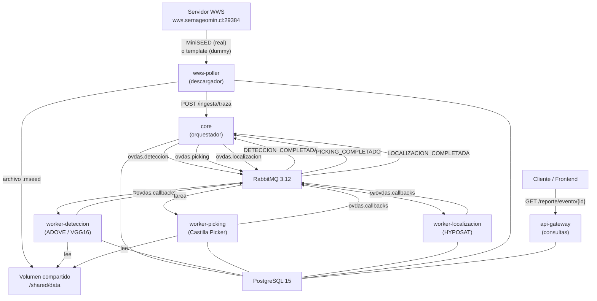
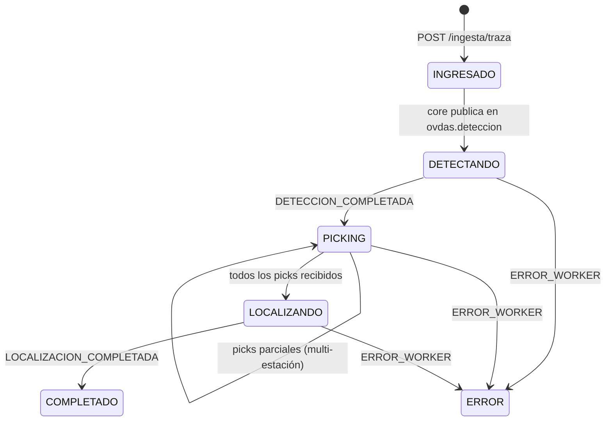

# OVDAS — Sistema de Monitoreo Volcánico (Microservicios)

Sistema de procesamiento sísmico automático para la red de vigilancia volcánica del
Observatorio Volcanológico de los Andes del Sur (OVDAS), rediseñado con arquitectura
de microservicios. Tesis de ingeniería civil informática — Joaquín Aracena, UFRO 2025.

---

## Arquitectura general



---

## Pipeline de estados



---

## Servicios

| Servicio | Puerto | Función |
|---|---|---|
| `core` | 8000 | Orquestador central — API REST + máquina de estados Saga |
| `worker-deteccion` | 8001 | Detección y clasificación sísmica (ADOVE / VGG16) |
| `worker-picking` | — | Picking de ondas P y S (Castilla Picker) |
| `worker-localizacion` | — | Localización hipocenter (HYPOSAT) |
| `wws-poller` | — | Descargador de trazas sísmicas |
| `api-gateway` | 8080 | Agregación de datos para frontend |
| `postgres` | 5432 | Base de datos principal |
| `rabbitmq` | 5672 / 15672 | Mensajería asíncrona |

---

## Colas RabbitMQ

| Cola | Productor | Consumidor | Contenido |
|---|---|---|---|
| `ovdas.deteccion` | core | worker-deteccion | tarea de detección |
| `ovdas.picking` | core | worker-picking | tarea de picking |
| `ovdas.localizacion` | core | worker-localizacion | tarea de localización |
| `ovdas.callbacks` | workers | core | resultados y errores |

Todas las colas son **durable** (persistentes en disco). El core y los workers usan
`heartbeat=0` en pika para evitar desconexiones durante procesamiento CPU-intensivo.

---

## Base de datos PostgreSQL

Patrón Database-per-Service implementado con **schemas separados** dentro de la misma
instancia (base de datos: `ovdas`).

```
ovdas/
├── core.pipeline_eventos   — estado del pipeline por evento
├── core.volcanes           — catálogo de volcanes (SSOT)
├── core.estaciones         — catálogo de estaciones (SSOT)
├── wws.descargas           — registro de archivos descargados
├── deteccion.resultados    — eventos detectados y clasificados
├── picking.resultados      — tiempos de arribo P/S
└── localizacion.resultados — hipocenter HYPOSAT
```

---

## Inicio rápido

```bash
# Desarrollo local (Docker Compose)
cd ovdas-core
docker compose up --build

# URLs
# Core API:     http://localhost:8000/docs
# API Gateway:  http://localhost:8080/docs
# RabbitMQ UI:  http://localhost:15672  (ovdas / ovdas)
```

### Escalar workers

```bash
docker compose up --scale worker-deteccion=3
```

### Verificar flujo completo

```bash
# Ver estado de un evento
curl http://localhost:8000/eventos | jq '.[0]'

# Reporte consolidado
curl http://localhost:8080/reporte/evento/<evento_id> | jq .
```

### Migración en base de datos existente

Si `init.sql` ya fue aplicado, ejecutar en orden:

```bash
# 1. Ampliar VARCHAR(3) → VARCHAR(10) para códigos de estación largos
psql -U ovdas -d ovdas -f db/migrate_estacion_varchar10.sql

# 2. Agregar columna snr a picking.resultados
psql -U ovdas -d ovdas -f db/migrate_picking_snr.sql

# 3. Crear schema localizacion
psql -U ovdas -d ovdas -f db/migrate_add_localizacion.sql

# 4. Importar catálogo completo de estaciones
psql -U ovdas -d ovdas -f db/migrate_estaciones_completo.sql
```

---

## Stack tecnológico

| Tecnología | Versión | Uso |
|---|---|---|
| Python | 3.11 | todos los servicios |
| FastAPI | latest | Core API, Worker Detección, API Gateway |
| pika | 1.3.2 | cliente RabbitMQ |
| psycopg2-binary | 2.9.9 | cliente PostgreSQL |
| ObsPy | ≥ 1.4.0 | lectura MiniSEED |
| NumPy / SciPy | latest | algoritmos sísmicos |
| PyTorch | latest | clasificación VGG16 |
| RabbitMQ | 3.12 | mensajería AMQP |
| PostgreSQL | 15 | persistencia |
| Docker Compose | — | desarrollo local |
| K3s | — | producción on-premise |

---

## Estructura del repositorio

```
ovdas-core/
├── core/                   # Orquestador central
├── worker-deteccion/       # Pipeline ADOVE (VGG16)
├── worker-picking/         # Picker P-S (Castilla)
├── worker-localizacion/    # Localización HYPOSAT
│   └── hypo/               # Binario HYPOSAT + tablas + stations.dat
├── wws-poller/             # Descargador de trazas
│   └── templates/          # Archivos MiniSEED de prueba
├── api-gateway/            # Agregación de datos
├── db/
│   ├── init.sql            # Esquema inicial completo
│   └── migrate_*.sql       # Migraciones incrementales
├── k8s/                    # Manifiestos Kubernetes (K3s)
├── scripts/                # Utilidades de despliegue
└── docker-compose.yml
```

---

## Multi-estación

El pipeline soporta procesamiento coordinado de múltiples estaciones bajo el mismo
`evento_id`. El `wws-poller` genera un `grupo_id` compartido por ciclo; el core lo
usa para agrupar picks y lanzar la localización solo cuando todos han llegado.

Para configurar estaciones en `docker-compose.yml`:

```yaml
ESTACIONES: "FU2:99,CHS:99,NBL:99,PLA:99"
```

Ver `wws-poller/README.md` y `core/README.md` para detalles.

---------------------------------------------------------------------------------------------------

## Cambios Patricio Valdés UCT (Rama de Evaluación y Refactorización)

**⚠️ Nota sobre Archivos Omitidos (Modelos de IA):**
Debido a las restricciones de almacenamiento de GitHub (archivos mayores a 100MB), los "cerebros" del modelo de Inteligencia Artificial original no fueron incluidos en este repositorio. 

Para que el contenedor `worker-deteccion` pueda levantarse localmente sin errores, es estrictamente necesario copiar de forma manual los siguientes dos archivos originales en la ruta `worker-deteccion/pipeline_v5/`:

1. `rep2_weights.pt` (~1.5 GB) - Contiene los pesos pre-entrenados de la red neuronal VGG16 en formato PyTorch.
2. `OOD_detector.pkl` (~247 MB) - Contiene el modelo K-Nearest Neighbors (Cleanlab) utilizado para detectar ruido fuera de distribución.

*Nota técnica: El archivo Dockerfile está configurado para ejecutar PyTorch exclusivamente en CPU (`--index-url https://download.pytorch.org/whl/cpu`), por lo que no se requiere entorno CUDA para ejecutar la inferencia de estos modelos.*