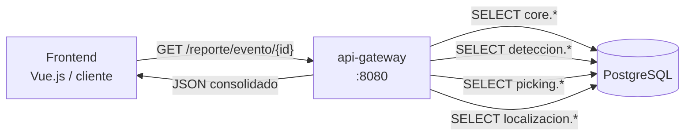
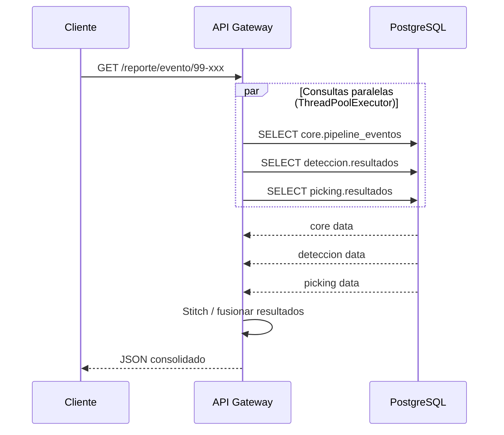

# API Gateway

Servicio de agregación de datos del sistema OVDAS. Implementa el patrón
**API Composition**: consolida en un único objeto JSON los resultados
distribuidos en múltiples schemas de PostgreSQL, evitando que el frontend
deba hacer N consultas separadas.

---

## Rol en la arquitectura



El gateway consulta los schemas en **paralelo** usando `ThreadPoolExecutor`
y fusiona (stitching) los resultados antes de responder.

---

## API REST

### `GET /reporte/evento/{evento_id}`

Reporte completo de un evento del pipeline.

**Respuesta:**
```json
{
  "evento_id": "99-20260307-a3f9c2",
  "pipeline": {
    "evento_id": "99-20260307-a3f9c2",
    "volcan_id": "99",
    "estacion_id": "FU2",
    "estado": "COMPLETADO",
    "traza_metadata": { "n_estaciones": 4, "grupo_id": "a3f9c2e1b4d7" },
    "error_msg": null,
    "created_at": "2026-03-07 03:28:25",
    "updated_at": "2026-03-07 03:28:35"
  },
  "deteccion": {
    "snr": 12.4,
    "label_event": "VT",
    "prob_vt": 0.87,
    "prob_lp": 0.05,
    "prob_tr": 0.04,
    "prob_ot": 0.04,
    "inicio": 1741305700.5,
    "fin": 1741305715.2,
    "largo": 14.7,
    "prom_ruido_fondo": 0.000231,
    "created_at": "2026-03-07 03:28:26"
  },
  "picking": {
    "estacion": "FU2",
    "componente": "Z",
    "t_p": 1741305702.49,
    "t_s": 1741305707.35,
    "amplitud": 853.84,
    "polar": null,
    "freq_dom": 4.8333,
    "delta_ts": 4.86,
    "created_at": "2026-03-07 03:28:28"
  },
  "localizacion": null,
  "clasificacion": null,
  "parametros": null
}
```

> `delta_ts` es calculado en el gateway: `t_s - t_p` (útil para estimación de distancia).

### `GET /eventos?limite=50&estado=COMPLETADO`

Lista paginada de eventos con datos básicos de detección y picking.

**Query params:**

| Parámetro | Tipo | Default | Descripción |
|---|---|---|---|
| `limite` | int | 50 | Máximo de eventos a retornar |
| `estado` | string | — | Filtrar por estado del pipeline |

**Respuesta:**
```json
[
  {
    "evento_id": "99-20260307-a3f9c2",
    "volcan_id": "99",
    "estacion_id": "FU2",
    "estado": "COMPLETADO",
    "created_at": "2026-03-07 03:28:25",
    "updated_at": "2026-03-07 03:28:35",
    "label_event": "VT",
    "snr": 12.4,
    "t_p": 1741305702.49,
    "t_s": 1741305707.35
  }
]
```

La consulta usa `LATERAL JOIN` para obtener el último registro de detección
y picking por evento en una sola query eficiente.

### `GET /volcanes`

Catálogo completo de volcanes monitoreados.

```json
[
  { "volcan_id": "99", "nombre": "Nevados de Chillán", "latitud": "-36.874108", "longitud": "-71.370274", "altura": "3212" },
  { "volcan_id": "VV", "nombre": "Villarrica", "latitud": "-39.420254", "longitud": "-71.940728", "altura": "2847" }
]
```

### `GET /health`

```json
{"status": "ok", "db": "up"}
```

---

## Patrón de consultas paralelas



---

## Variables de entorno

| Variable | Default | Descripción |
|---|---|---|
| `POSTGRES_DSN` | `host=postgres port=5432 dbname=ovdas user=ovdas password=ovdas` | Conexión PostgreSQL |

---

## CORS

El gateway tiene CORS abierto (`allow_origins=["*"]`) para facilitar la integración
con el frontend Vue.js legacy que corre en un origen distinto.

---

## Schemas consultados

| Schema | Tabla | Qué se consulta |
|---|---|---|
| `core` | `pipeline_eventos` | Estado, metadata, volcán, estación |
| `deteccion` | `resultados` | SNR, tipo de evento, probabilidades |
| `picking` | `resultados` | Tiempos P/S, amplitud, frecuencia |
| `core` | `volcanes` | Catálogo de volcanes |

> En la versión actual `localizacion`, `clasificacion` y `parametros`
> retornan `null`. Se agregarán cuando los workers correspondientes
> sean integrados al gateway.

---

## Archivos

| Archivo | Función |
|---|---|
| `main.py` | FastAPI app, endpoints, consultas paralelas, stitching |
| `Dockerfile` | Imagen del servicio |
| `requirements.txt` | `fastapi`, `uvicorn`, `psycopg2-binary` |
