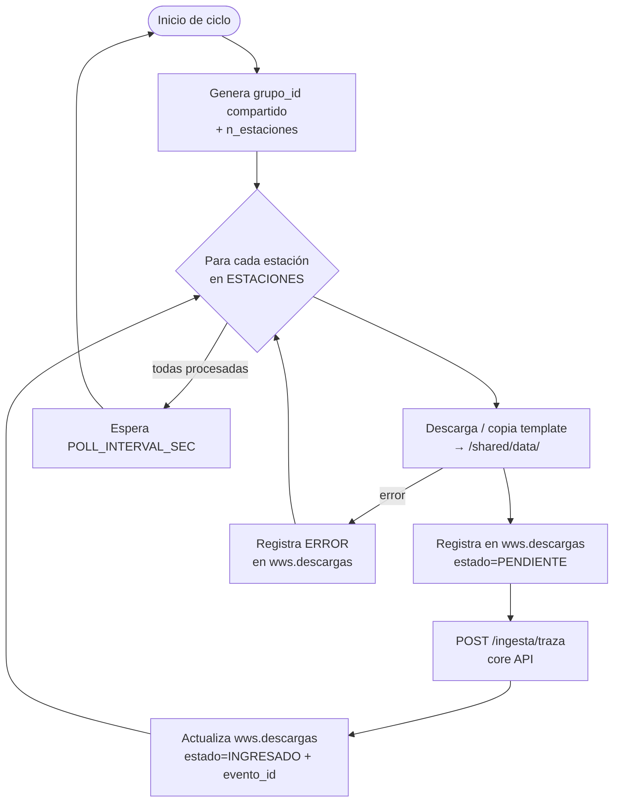
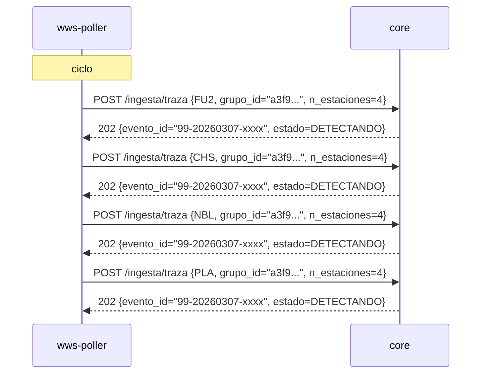

# WWS Poller

Servicio de adquisición de datos sísmicos. Opera en un ciclo periódico descargando
trazas desde el servidor **Winston Wave Server (WWS)** de Sernageomin y entregándolas
al core para iniciar el pipeline de procesamiento.

Soporta dos modos de operación:
- **Dummy (desarrollo):** copia archivos template MiniSEED del directorio `/templates/`
- **Producción:** consulta el servidor WWS real usando `WavePyWWS`

---

## Flujo por ciclo



---

## Multi-estación: cómo funciona el grupo_id

En cada ciclo el poller genera un `grupo_id` único (UUID hex de 12 chars).
Todas las estaciones del mismo ciclo comparten este `grupo_id` en el payload
del POST al core. Esto permite al core agrupar los picks de múltiples estaciones
bajo un único `evento_id`, habilitando la localización multi-estación.



---

## Modo dummy (desarrollo)

El `WWSClient` busca archivos template en `/templates/` usando un glob por nombre
de estación: `*{ESTACION}*`. No importa la extensión.

Archivos template disponibles (incluidos en la imagen Docker):

| Archivo | Estación | Canal | Volcán |
|---|---|---|---|
| `TC.FU2..HH.mseed` | FU2 | HH | 99 (Chillán) |
| `TC.CHS..HH.mseed` | CHS | HH | 99 (Chillán) |
| `TC.NBL..HH.mseed` | NBL | HH | 99 (Chillán) |
| `TC.PLA..HH.mseed` | PLA | HH | 99 (Chillán) |
| `TC.VN2..HH.mseed` | VN2 | HH | VV (Villarrica) |
| `TC.PGT..HD.mseed` | PGT | HD | — |

El archivo se copia renombrado con el timestamp actual:
`FU2_Z_20260307_030000.mseed`

---

## Base de datos

### `wws.descargas`

| Columna | Tipo | Descripción |
|---|---|---|
| `id` | SERIAL PK | — |
| `estacion` | VARCHAR(10) | Código de estación |
| `componente` | CHAR(1) | Componente (`Z`) |
| `inicio_unix` | DOUBLE PRECISION | Inicio de la ventana solicitada |
| `fin_unix` | DOUBLE PRECISION | Fin de la ventana solicitada |
| `archivo` | VARCHAR(255) | Nombre del archivo en `/shared/data/` |
| `estado` | VARCHAR(20) | `PENDIENTE` → `INGRESADO` / `ERROR` |
| `evento_id` | VARCHAR(25) | Asignado por el core al aceptar |
| `worker_resp` | JSONB | Respuesta JSON del core (o error) |

El campo `archivo` es la clave que permite a `worker-picking` encontrar
el archivo correcto: consulta `wws.descargas WHERE evento_id = ?`.

---

## Variables de entorno

| Variable | Default | Descripción |
|---|---|---|
| `WWS_HOST` | `wws.sernageomin.cl` | Host del servidor WWS |
| `WWS_PORT` | `29384` | Puerto del servidor WWS |
| `POLL_INTERVAL_SEC` | `300` | Segundos entre ciclos (5 min) |
| `ESTACIONES` | `"FU2:99"` | Estaciones: `"EST:VOL,EST2:VOL2"` |
| `COMPONENTE` | `Z` | Componente sísmica |
| `CANAL` | `HHZ` | Canal completo para WWS |
| `DURACION_SEG` | `3600` | Duración de la ventana (1h) |
| `MUESTRA_HZ` | `100` | Frecuencia de muestreo esperada |
| `SHARED_DATA_DIR` | `/shared/data` | Volumen compartido con workers |
| `TEMPLATES_DIR` | `/templates` | Templates MiniSEED (modo dummy) |
| `POSTGRES_DSN` | `host=postgres ...` | Conexión PostgreSQL |
| `CORE_API_URL` | `http://core:8000` | URL base del core orchestrator |

---

## Archivos

| Archivo | Función |
|---|---|
| `poller.py` | Loop principal, ciclo de polling, registro en DB |
| `wws_client.py` | Cliente WWS: modo dummy (template) y producción (WWS real) |
| `templates/` | Archivos MiniSEED de referencia para pruebas |
| `Dockerfile` | Imagen del servicio |

---

## Modo producción (WWS real)

Para activar la conexión real al servidor WWS, en `wws_client.py`:

```python
DUMMY_MODE = False
```

Y descomentar el bloque marcado con `── IMPLEMENTACIÓN REAL ──` en `get_waveform()`,
que llama a `WavePyWWS.getWavefromWWS()` con los parámetros de la ventana temporal.

---

## Notas importantes

- Cada ciclo puede generar entre 0 y N eventos sísmicos según el contenido del archivo.
- En producción con `DURACION_SEG=300` (5 min) se esperan 0–5 eventos por ciclo.
- Con archivos de 24h en modo dummy se generan 100–600+ eventos (uso solo para pruebas de carga).
- El volumen `seismic-data` debe ser accesible también por `worker-deteccion` y `worker-picking`.
